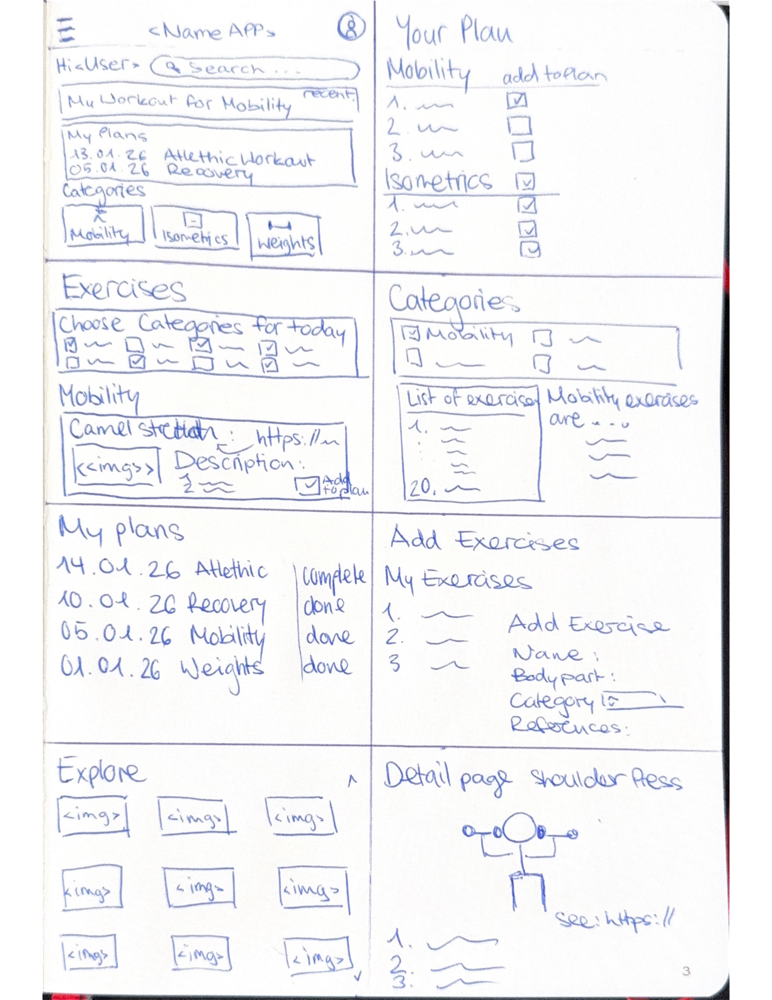

# Projektdokumentation - [PlanCrafter]

## Inhaltsverzeichnis

1. [Ausgangslage](#1-ausgangslage)
2. [Lösungsidee](#2-lösungsidee)
3. [Vorgehen & Artefakte](#3-vorgehen--artefakte)
    1. [Understand & Define](#31-understand--define)
    2. [Sketch](#32-sketch)
    3. [Decide](#33-decide)
    4. [Prototype](#34-prototype)
    5. [Validate](#35-validate)
4. [Erweiterungen [Optional]](#4-erweiterungen-optional)
5. [Projektorganisation [Optional]](#5-projektorganisation-optional)
6. [KI-Deklaration](#6-ki-deklaration)
7. [Anhang [Optional]](#7-anhang-optional)

> **Hinweis:** Massgeblich sind die im **Unterricht** und auf **Moodle** kommunizierten Anforderungen.

<!-- WICHTIG: DIE KAPITELSTRUKTUR DARF NICHT VERÄNDERT WERDEN! -->

<!-- Diese Vorlage ist für eine README.md im Repository gedacht. Abschnitte mit [Optional] können weggelassen werden, wenn in den Übungen nichts anderes verlangt wird. -->

## 1. Ausgangslage
- **Problem:** Viele Sportler:innen und Studierende verbringen unverhältnismässig viel Zeit damit, passende Übungen zu recherchieren und einen sinnvollen Trainingsplan zusammenzustellen. Die schiere Menge an Trainingsmethoden – von klassischem Krafttraining über Mobility und Plyometrics bis hin zu Kettlebell und Agility – führt zu Entscheidungsmüdigkeit und Unsicherheit. Bestehende Lösungen sind entweder zu komplex und abo-basiert (z. B. Freeletics, Fitbod), zu starr mit vorgefertigten Plänen, oder reine Nachschlagewerke ohne interaktive Planungsfunktion (z. B. MuscleWiki, ExRx.net). Es fehlt ein schlankes Tool, das Übungen Trainingskategorie filterbar macht und mit wenigen Klicks einen individuellen Trainingsplan generiert.
- **Ziele:**
  - Eine Web-App entwickeln, mit der Nutzer:innen in unter 2 Minuten einen individuellen Trainingsplan zusammenstellen können
  - Übungen sind filterbar nach Trainingskategorie (Athletic, Mobility, Plyometrics, Isometrics, Kraft, Kettlebell, Rotation)
  - Per Klick werden Übungen in eine visuelle Trainingsplan-Übersicht übernommen
  - Jede Trainingskategorie verfügt über eine eigene Detailseite mit allen zugehörigen Übungen
  - Minimalistisches, intuitives UI – keine Registrierung, kein Abo, keine Überfrachtung
- **Primäre Zielgruppe:** Ambitionierte Hobby-Athlet:innen und Studierende mit Fitness-Interesse, die mehrere Trainingsstile kombinieren und sich beim Planen Zeit sparen möchten. Sekundär auch Fitness-Einsteiger:innen, die eine übersichtliche, gefilterte Übungsauswahl mit tiefer Einstiegshürde suchen.
- **Weitere Stakeholder [Optional]:** Trainer:innen und Coaches, die das Tool nutzen könnten, um schnell Trainingsvorlagen für ihre Klient:innen zu erstellen.
## 2. Lösungsidee
 
- **Kernfunktionalität:** Der zentrale Workflow der Web-App gliedert sich in drei Schritte:
  1. **Filtern** – Nutzer:innen wählen eine Trainingskategorie aus.
  2. **Auswählen** – Alle passenden Übungen werden angezeigt. Per Klick auf eine Übung wird diese direkt in die Trainingsplan-Übersicht aufgenommen.
  3. **Übersicht** – Der zusammengestellte Trainingsplan wird als kompakte visuelle Übersicht dargestellt, die alle gewählten Übungen für die aktuelle Session enthält.
  Ergänzend verfügt jede Trainingskategorie (Athletic, Mobility, Plyometrics, Isometrics, Kraft, Kettlebell, Rotation) über eine eigene Detailseite, auf der alle Übungen dieser Kategorie aufgelistet und beschrieben sind.
- **Annahmen [Optional]:**
  - Nutzer:innen wissen grundsätzlich, welche Muskelgruppe(n) sie trainieren möchten, benötigen aber Unterstützung bei der konkreten Übungsauswahl.
  - Der Kategorien-Filter bietet genügend Steuerung, um relevante Übungen schnell einzugrenzen.
  - Ein minimalistischer «Klick-zum-Plan»-Workflow wird gegenüber algorithmisch generierten Plänen bevorzugt, da er den Nutzer:innen mehr Kontrolle überlässt.
- **Abgrenzung [Optional]:**
  - Kein automatisch generierter Trainingsplan (kein AI-Coach, keine Periodisierung)
  - Kein Tracking von Gewichten, Sätzen oder Wiederholungen – der Fokus liegt auf der Planerstellung, nicht auf dem Logging
  - Keine Social Features (kein Sharing, kein öffentliches Profil)
  - Keine eigene Video-/Animations-Produktion – es wird auf bestehende Quellen (z. B. YouTube, MuscleWiki) verlinkt
## 3. Vorgehen & Artefakte
 
Die Durchführung erfolgt phasenbasiert; nachfolgend sind die wichtigsten Ergebnisse je Phase dokumentiert.
 
### 3.1 Understand & Define
 
- **Zielgruppenverständnis:**
  **Problemräume:**
  - Viele Sportler:innen und Studierende investieren unverhältnismässig viel Zeit in die Recherche passender Übungen und das Zusammenstellen eines sinnvollen Trainingsplans.
  - Die Menge an Trainingsmethoden und -philosophien (Kraft, Mobility, Plyometrics, Isometrics, Kettlebell, Rotation) führt zu Entscheidungsmüdigkeit – besonders wenn mehrere Stile kombiniert werden sollen.
  - Social Media präsentiert ständig neue Übungen, die zwar gespeichert, aber selten strukturiert in den Trainingsalltag integriert werden.
  - Bestehende Tools sind entweder überladene Coaching-Apps mit Abo-Modell, starre vorgefertigte Pläne oder reine Nachschlagewerke ohne Planungsfunktion.
  - Athlet:innen, die mehrere Disziplinen kombinieren (z. B. Kraft + Plyometrics + Mobility), finden in klassischen Bodybuilding-Apps kaum passende Inhalte.
  **Personas:**
  | Nutzer | Bedürfnisse | Kontext / Herausforderungen | HMW (How Might We) |
  |---|---|---|---|
  | **Ambitionierte Athlet:innen** (Hobby- und Wettkampfsport, kombinieren mehrere Trainingsstile) | Schnelle, flexible Plan-Erstellung über mehrere Kategorien hinweg (z. B. Kraft + Plyometrics + Mobility); klare Übersicht über die geplante Session | Wechselnde Trainingsziele je nach Saison/Phase, begrenzte Zeit, sehr viele in Frage kommende Übungen, hoher Anspruch an Variation | Wie könnten wir Athlet:innen ermöglichen, mit wenigen Klicks einen individuellen Plan über mehrere Trainingskategorien hinweg zusammenzustellen? |
  | **Studierende mit Fitness-Interesse** | Zeitersparnis, einfache Bedienung, geringe Einstiegshürde, kein Abo | Stress durch Studium, knappe Zeitfenster zwischen Vorlesungen, wenig Erfahrung mit strukturierter Trainingsplanung, begrenztes Budget | Wie könnten wir die Trainingsplan-Erstellung so unkompliziert gestalten, dass auch Studierende ohne Vorwissen sie in unter 2 Minuten nutzen können? |
  | **Fitness-Einsteiger:innen** | Übersichtliche, gefilterte Auswahl; Sicherheit bei der Übungswahl; visuelle Orientierung | Unsicherheit bei der Auswahl, Angst vor Fehlern oder Verletzungen, Überforderung durch zu viele Optionen, fehlendes Vokabular | Wie könnten wir Einsteiger:innen helfen, passende Übungen je Muskelgruppe zu finden und so motiviert dranzubleiben? |
  | **Trainer:innen / Coaches** (sekundäre Zielgruppe) | Schnelles Erstellen von Vorlagen, die sie an Klient:innen weitergeben können | Wenig Zeit zwischen Sessions, Bedarf an strukturierten, wiederverwendbaren Plänen | Wie könnten wir Coaches ermöglichen, Trainingspläne effizient als Vorlage zu erstellen und zu teilen? |
- **Wesentliche Erkenntnisse:**
  - Bestehende Fitness-Apps (Freeletics, Fitbod, Jefit) sind entweder stark algorithmisch/abo-basiert oder fokussieren sich fast ausschliesslich auf klassisches Krafttraining. Die Kombination verschiedener Trainingsstile wird kaum in einem Tool abgedeckt.
  - Reine Nachschlagewerke wie Lift Manual, ExRx.net oder MuscleWiki bieten umfassende Übungsdatenbanken, jedoch keine interaktive Planerstellung.
  - Nutzer:innen wünschen sich vor allem Geschwindigkeit, Übersichtlichkeit und Filtermöglichkeiten nach Muskelgruppe und Trainingsart – nicht zwingend mehr Inhalte.
  - Eine visuelle Übersicht des zusammengestellten Plans wirkt motivierend und verringert die Wahrscheinlichkeit, eine Session abzubrechen.
  - Studierende und Berufstätige bewerten Zeitersparnis und reibungslose UX höher als Premium-Features (Statistiken, Social Sharing, Gamification).
  - Der USP liegt in der Kombination aus breiter Kategorienabdeckung (Athletic, Plyometrics, Mobility etc.) und einem minimalistischen Klick-zum-Plan-Workflow – dort wo bestehende Lösungen entweder zu schwer oder zu eingeschränkt sind.

### 3.2 Sketch
 
Im Rahmen einer Crazy-8s-Session wurden zwei Varianten für die App-Struktur skizziert.
 
- **Variantenüberblick:**
  | | Variante A – Karussell-Homepage | Variante B – Dashboard-Homepage |
  |---|---|---|
  | **Homepage** | Grosses Karussell mit Übungsvorschlägen, weiterklicken nötig um an Kernfunktionen zu gelangen | Dashboard-Layout mit mehreren Containern: aktueller Plan, My Plans, Kategorien, Explore – alles auf einen Blick |
  | **Navigation** | Home, Your Plan, Exercises, Categories + separate Help-Seite | Home, Your Plan, Exercises, Categories + Add Exercises (ersetzt Help) |
  | **Help / Add** | Eigene Help-Seite mit externen Links (Lift Manual, Workout Wiki) | Help-Seite wird zu einer **Add Exercise**-Seite umfunktioniert: Nutzende können eigene Übungen anlegen (Name, Bodypart, Category, References) |
  | **Exercises** | Kategorie-Filter via Checkboxen, Übungskarten mit Bild, Beschreibung und «Add to Plan» | Gleiche Grundstruktur, zusätzlich Checkbox pro Übung für schnelleres Hinzufügen |
  | **Your Plan** | Übungen gruppiert nach Kategorie als Liste | Gleich, ergänzt um «Add to Plan»-Button und Checkboxen |
  | **My Plans** | Chronologische Liste mit Datum und Titel | Gleich, ergänzt um Status-Spalte (complete / done) |
  | **Categories** | Kategorie-Liste mit Klick auf Detailseite | Gleich, zusätzlich farbkodierte Icons pro Kategorie |
  | **Explore** | 3×3-Grid mit Übungsbildern | Gleich |
  | **Detail Page** | Übungsillustration, Beschreibung, nummerierte Schritte | Gleich, ergänzt um Referenz-Link |
- **Skizzen:**
  - **Variante A** (Crazy-8s, Seite 1): Karussell-basierte Homepage mit separater Help-Seite. Alle Kernfunktionen (Plan, Exercises, Categories) nur über Navigation erreichbar.

  - **Variante B** (überarbeitete Skizze, Seite 3): Dashboard-Homepage mit «Hi \<User\>»-Begrüssung, Suchleiste, Container für Recent Workout, My Plans, Categories und Explore. Help-Seite durch Add Exercise ersetzt. Floating «+»-Button für schnellen Zugriff.

    
### 3.3 Decide
 
- **Gewählte Variante & Begründung:** Variante B – Dashboard-Homepage. Die Homepage ist der Einstiegspunkt und prägt den ersten Eindruck am stärksten. Das ursprüngliche Karussell (Variante A) nutzte den verfügbaren Platz nicht aus und zwang Nutzende, aktiv weiterzuklicken, um an die Kernfunktionen zu gelangen. Das Dashboard-Layout zeigt alle wichtigen Bereiche (aktueller Plan, My Plans, Kategorien, Explore) direkt auf der Startseite als Container an.
  **Entscheidkriterien:**
  - *Sofortiger Überblick:* Dashboard zeigt alle Kernfunktionen ohne zusätzliche Navigation.
  - *Feedback-getrieben:* Drei Rückmeldungen aus der Sketch-Session flossen direkt ein (siehe unten).
  - *Mehrwert statt Leerseite:* Die überflüssige Help-Seite wurde zur Add Exercise-Seite umgewandelt – Nutzende können eigene Übungen anlegen, was die App über die vordefinierte Datenbank hinaus flexibel macht.
  **Erhaltenes Feedback und Einfluss auf die Entscheidung:**
  1. Die Help-Seite wirkte als eigene Hauptseite überflüssig → Umfunktionierung zu einer **Add Exercise**-Seite mit Formular (Name, Bodypart, Category, References) und Liste eigener Übungen.
  2. Die Homepage sollte nutzerfreundlicher gestaltet werden, indem die wichtigsten Features als Container auf derselben Seite dargestellt werden → **Dashboard-Layout** mit Containern für Recent Workout, My Plans, Categories und Explore.
  3. Kategorien sollen visuell und funktional klar unterscheidbar sein → **Farbkodierung und Icons** pro Kategorie; Überschneidungen werden später über Tags abgebildet.
- **End-to-End-Ablauf:**

  Der zentrale Nutzungsflow gliedert sich in vier Schritte:

  1. **Einstieg (Home):** Nutzer:in öffnet die App; die Homepage zeigt den aktiven Plan (falls vorhanden), die zwei neuesten eigenen Pläne sowie alle Trainingskategorien als Kacheln.
  2. **Übungen finden:** Via *Exercises* (Kategorie-Chip-Filter) oder *Categories* (direkter Kategorie-Einstieg) werden passende Übungen gesucht. Die Detailseite zeigt Bild, Muskelgruppen-Visualisierung und Schritt-für-Schritt-Anleitung.
  3. **Plan zusammenstellen:** «+»-Button fügt eine Übung dem Draft-Plan hinzu (bei mehreren aktiven Plänen: Inline-Picker zur Zuweisung). *Your Plan* zeigt alle gewählten Übungen; Plan benennen → Speichern.
  4. **Workout durchführen:** Plan über *Plans* starten, Timer aktivieren, Übungen abhaken; Plan schliesst automatisch ab wenn alle erledigt – oder manuell via «Training abschliessen».

- **Mockup:** Referenz-Mockup (High-Fidelity) erstellt in Figma, basierend auf Variantenentscheid B (Dashboard-Homepage). Abgedeckte Screens: Home, Exercises, Your Plan, Categories und Übungsdetail.

  

#### 3.4 Prototype

#### 3.4.1 Entwurf (Design)


##### Informationsarchitektur

Der Prototyp ist um fünf Hauptbereiche organisiert, die über eine persistente Bottom-Navigation jederzeit erreichbar sind:

- **Home:** Einstiegspunkt mit aktuellem Workout, eigenen Plänen und Kategorien
- **Exercises:** Übungsliste mit Filterfunktion
- **Your Plan:** Aktiver Trainingsplan
- **Categories:** Übungen nach Trainingsart gruppiert
- **Add:** Formular zum Erfassen eigener Übungen

Die Navigationsstruktur ist flach gehalten – alle zentralen Funktionen sind mit maximal zwei Taps erreichbar. Detailansichten öffnen sich kontextuell aus den Listenansichten.

##### User Interface Design

Die wichtigsten Screens des Prototyps und ihre Interaktionen:

- **Home:** Tap auf "Current Workout" startet das aktive Training. Pläne und Kategorien sind direkt anwählbar.
- **Exercises:** Filter-Chips schalten zwischen Trainingsarten um. Der "+"-Button fügt eine Übung dem Plan hinzu und kehrt zur Liste zurück.
- **Your Plan:** Zeigt die hinzugefügten Übungen gruppiert nach Kategorie.
- **Categories:** Tap auf eine Kategorie öffnet die zugehörige Übungsliste.
- **Add Exercise:** Formular mit Dropdown für Kategorien; "Save Exercise" speichert und kehrt zur Übersicht zurück.
- **Übungsdetail:** Zeigt Bild, Tags und Schritt-für-Schritt-Anweisungen zur Übung.

##### Designentscheidungen

- **Dark Mode:** Reduziert Blendwirkung beim Training, schont den Akku auf OLED-Displays und entspricht den Konventionen gängiger Fitness-Apps.
- **Bottom-Navigation:** Permanente Erreichbarkeit der fünf Hauptbereiche reduziert den Navigationsaufwand und folgt etablierten Mobile-Patterns.
- **Card-basiertes Layout:** Bietet gute Lesbarkeit, Platz für Bildmaterial und ausreichend grosse Touch-Flächen.
- **"+"-Button für Schnellaktionen:** Übungen lassen sich direkt aus der Liste zum Plan hinzufügen, ohne Kontextwechsel.
- **Farbliche Akzente pro Kategorie:** Verbessern die Wiedererkennbarkeit und unterstützen die visuelle Orientierung.
- **Flache Navigationshierarchie:** Hält den Klickpfad kurz und vermeidet unnötige Zwischenebenen.

##### Workflows & Testanleitung

Alle Funktionalitäten können lokal unter `http://localhost:5173` getestet werden (`npm run dev` im Ordner `PlanCrafter`). Die App unterstützt Login/Registrierung; ohne Account läuft alles unter dem Demo-User (`userId: "demo"`).

---

###### Workflow 1: Registrierung, Login & Profil

1. «Anmelden»-Link in der Topbar antippen → Weiterleitung zu `/login`
2. «Registrieren»-Link antippen → `/register` → Benutzername (min. 3 Zeichen) und Passwort (min. 6 Zeichen) eingeben → «Konto erstellen»
3. Weiterleitung zur Homepage; Benutzername-Chip in der Topbar erscheint
4. 👤-Icon antippen → Profilseite (`/profile`) mit **Contributions-Heatmap** (52-Wochen-Grid, jeder Login = 1 Contribution) und «Abmelden»-Button
5. **Abmelden:** auf der Profilseite «Abmelden» antippen → Session wird gelöscht, Weiterleitung zu `/login`
6. **Ohne Account:** «Ohne Konto fortfahren (Demo)» antippen → App funktioniert mit `userId: "demo"`

###### Workflow 2: Übungen durchsuchen und suchen

1. Navigation → *Exercises* → alle Übungen werden geladen
2. Kategorie-Chip (z. B. «Kraft») antippen → Liste filtert auf diese Kategorie
3. Suchfeld tippen (z. B. «Squat») → **Echtzeit-Suchvorschläge** erscheinen (Übungen und Kategorien), reaktive Listenfilterung ohne Reload
4. Alternativ: 🔍-Icon in der Topbar antippen → Sucheingabe erscheint inline mit **Autocomplete-Dropdown** für Übungen & Kategorien
5. Übung antippen → Detailseite mit Bild, Kategorie-Badge, bodyParts-Badges, **BodyMap-Anatomieübersicht**, Schritt-für-Schritt-Anleitung und Referenz-Link

###### Workflow 3: Kategoriebasiert suchen

1. Navigation → *Categories* → alle 7 Kategorien mit Übungsanzahl; **Suchfeld** filtert Kategorien reaktiv
2. Kategorie antippen → Übungsliste dieser Kategorie
3. Übung antippen → Detailseite (Zurück-Button navigiert zur Kategorie zurück)

###### Workflow 4: Plan erstellen und Workout durchführen

1. Auf einer Übungsliste (Exercises, Categories oder Detailseite) den **+**-Button antippen
   - **Kein aktiver Plan vorhanden:** Übung wird direkt einem Draft-Plan hinzugefügt
   - **Aktive Pläne vorhanden:** Inline-Picker öffnet sich — «+ Neuer Entwurf» oder bestehenden Plan wählen
2. Toast-Popup erscheint oben rechts mit Übungsname und «Zum Plan →»-Link
3. Navigation → *Your Plan* → Draft-Plan in der Sektion «Plan in Bearbeitung» sichtbar
4. Unerwünschte Übungen mit **✕** entfernen (live, kein Reload)
5. Plan benennen (Textfeld) → **Speichern** → Plan erscheint in «Meine Pläne»
6. Plan antippen → Detailseite (`/plans/[id]`) → Fortschrittsbalken + Übungen mit Checkboxen
7. **Timer starten:** «▶ Start»-Button antippen → Stoppuhr läuft im Format **HH:MM:SS.ms** (Stunden, Minuten, Sekunden, Millisekunden); Pause/Reset möglich
8. Übungen abhaken: Überall auf das Übungs-Feld tippen (nicht nur auf den Kreis) → Übung wird als erledigt markiert (live, kein Reload); sobald alle erledigt: Plan automatisch abgeschlossen
9. **Partieller Abschluss:** «Training abschliessen (x/y)»-Button antippen → Plan wird abgeschlossen; **gemessene Zeit wird gespeichert und als Bestzeit angezeigt**

###### Workflow 5: Gespeicherte Pläne verwalten

1. Navigation → *Plans* → **obere Hälfte:** «Neuen Plan erstellen»-Button; **untere Hälfte:** alle gespeicherten Pläne mit direkten Aktions-Buttons:
   - **✏️ (Bearbeiten):** Öffnet die Bearbeitungsseite (`/plans/[id]/edit`) → Umbenennen, Übungen hinzufügen/entfernen
   - **▶ (Starten):** Plan sofort aktivieren und zu *Your Plan* navigieren — kein Hineinklicken erforderlich
2. Plan antippen → Detailseite mit Timer (HH:MM:SS.ms), Fortschrittsbalken, Übungsliste, **Bestzeit** und «Training abschliessen»-Button
3. Abgeschlossener Plan: «Erneut starten» → Haken werden zurückgesetzt, Plan wird wieder aktiv
4. Home → *My Plans* zeigt die 2 neuesten Pläne; **View all** → vollständige Planliste

###### Workflow 6: Eigene Übung erfassen

1. Navigation → *Add* → Formular mit Name, Kategorie (Dropdown), **Muskelgruppen** (anklickbare Checkbox-Pills für 14 Body-Parts) und Referenz-URL
2. **«Übung speichern»** → eigene Übung wird in MongoDB gespeichert (`isCustom: true`, `userId` des eingeloggten Nutzers)
3. Weiterleitung zu `/exercises` → eigene Übung erscheint in der Liste der gewählten Kategorie

###### Workflow 7: Home-Navigation, Empfehlungen & Explore-Karussell

1. *Current Workout*-Card zeigt den aktiven/nicht abgeschlossenen Plan → Antippen öffnet *Your Plan*
2. *My Plans* zeigt die 2 neuesten Pläne → direkt anwählbar
3. *Categories*-Kacheln → direkt zur Kategorie-Detailseite (auf kleinen Bildschirmen 4-spaltig)
4. **«Für dich empfohlen»**-Grid → zeigt Übungen aus der meistgenutzten Trainingskategorie des Users (erscheint sobald Pläne mit Übungen vorhanden)
5. **Explore-Karussell** → 3 Slides à 8 Übungen (2 Zeilen × 4 Spalten); Übungen wechseln täglich (datum-basierter Seed); Swipe auf Mobile, Pfeile auf Desktop
6. ☀️/🌙-Toggle in der Topbar → wechselt zwischen Dark Mode und Light Mode (Einstellung wird in localStorage gespeichert)
7. «PlanCrafter»-Schriftzug oben → navigiert immer zur Homepage

###### Workflow 8: Profil & Aktivitäts-Heatmap

1. 👤-Icon in der Topbar antippen (wenn angemeldet) → Profilseite `/profile`
2. **Contributions-Heatmap:** 52-Wochen-Grid à 7 Tage (ähnlich GitHub/GitLab); Farbintensität zeigt Anzahl Logins pro Tag
3. Gesamtzahl aller Logins wird angezeigt
4. «Abmelden»-Button auf der Profilseite


#### 3.4.2. Umsetzung (Technik)

- **Technologie-Stack:**
  - **Frontend:** SvelteKit 5 (Svelte 5 Syntax, File-based Routing, SSR via `+page.server.js`)
  - **Styling:** Bootstrap 5.3.3 (CSS only, eingebunden via CDN in `+layout.svelte`), Dark/Light-Theme via `app.css` mit CSS-Custom-Properties (`data-theme="light"`-Attribut auf `<html>`), Theme-Persist via `localStorage`
  - **Backend:** SvelteKit Server-Routes (Node.js), MongoDB Node.js Driver v7
  - **Datenbank:** MongoDB Atlas (Cloud, Cluster `Cluster1DM`), Datenbankname `PT_Project_PlanCrafter`
  - **Datenverwaltung lokal:** JSON-Dateien unter `data/` für den manuellen Import via MongoDB Compass

- **Tooling:**
  - Visual Studio Code mit SvelteKit- und MongoDB-Erweiterungen
  - MongoDB Compass für visuellen Datenbankzugriff und manuellen Import der JSON-Dateien
  - Node.js / npm für lokale Entwicklung (`npm run dev`)
  - Python 3 für das Hilfsskript `scripts/add_descriptions.py` zur Datenvorbereitung
  - Vite als Build-Tool (via SvelteKit)

- **Struktur & Komponenten:**

  ```text
  src/
  ├── hooks.server.js            # Session-Middleware: setzt event.locals.userId / .username
  ├── lib/
  │   ├── components/
  │   │   └── BodyMap.svelte     # SVG-Körperschema mit Muskelgruppen-Highlighting
  │   ├── server/
  │   │   ├── auth.js            # Passwort-Hashing (scrypt), Session-Verwaltung
  │   │   ├── db.js              # MongoDB-Verbindung, serialize(), USER_ID (Fallback)
  │   │   └── planHelper.js      # Shared-Helfer: Draft holen/erstellen, Übung hinzufügen/Plan zuweisen
  │   ├── i18n.svelte.js         # Reaktiver DE/EN-Sprachstate (Svelte-5-Klasse, localStorage-Persist)
  │   └── toast.svelte.js        # Reaktiver Toast-State (Svelte-5-Klasse, seitenübergreifend)
  ├── routes/
  │   ├── +layout.server.js      # Load: username aus Session → an Layout übergeben
  │   ├── +layout.svelte         # Bootstrap CDN, globales Layout, Bottom-Navigation, Topbar-Suche
  │   ├── +page.svelte           # Homepage (Empfehlungen, Explore-Karussell)
  │   ├── +page.server.js        # Load: activePlan, myPlans, categories, explore, recommended
  │   ├── categories/
  │   │   ├── +page.svelte       # Alle 7 Kategorien mit Suchfilter
  │   │   ├── +page.server.js
  │   │   └── [slug]/
  │   │       ├── +page.svelte   # Übungen mit "+"-Button / Plan-Picker
  │   │       └── +page.server.js # Load + addToPlan Action (Draft oder spezifischer Plan)
  │   ├── exercises/
  │   │   ├── +page.svelte       # Übungsliste mit Suchfeld, Kategorie-Chips, Plan-Picker
  │   │   ├── +page.server.js    # Load + addToPlan Action
  │   │   └── [id]/
  │   │       ├── +page.svelte   # Übungsdetailseite mit BodyMap, Plan-Picker
  │   │       └── +page.server.js # Load + addToPlan Action
  │   ├── login/
  │   │   ├── +page.svelte       # Login-Formular
  │   │   └── +page.server.js    # Passwort verifizieren, Session erstellen
  │   ├── profile/
  │   │   ├── +page.svelte       # Profilseite: Avatar, Contributions-Heatmap, Logout-Button
  │   │   └── +page.server.js    # Load: logins[]; Action logout: Session löschen
  │   ├── plan/
  │   │   ├── +page.svelte       # Draft/Aktiver Plan mit Timer, Abschliessen-Button
  │   │   └── +page.server.js    # Load + saveName / toggleDone / removeExercise / completePlan
  │   ├── plans/
  │   │   ├── +page.svelte       # Alle gespeicherten Pläne mit Bearbeiten/Starten-Buttons
  │   │   ├── +page.server.js    # Load + activate Action
  │   │   └── [id]/
  │   │       ├── +page.svelte   # Plandetailseite mit Timer, "Training abschliessen"-Button
  │   │       ├── +page.server.js # Load + restart / toggleDone / completePlan Actions
  │   │       └── edit/
  │   │           ├── +page.svelte   # Plan bearbeiten (Umbenennen, Übungen verwalten)
  │   │           └── +page.server.js
  │   ├── register/
  │   │   ├── +page.svelte       # Registrierungs-Formular
  │   │   └── +page.server.js    # User anlegen, Session erstellen
  │   └── add-exercise/
  │       ├── +page.svelte       # Formular eigene Übung erfassen (Name, Kategorie, Muskelgruppen, Referenz-URL)
  │       └── +page.server.js    # create Action (isCustom: true), Redirect zu /exercises
  └── app.css                    # Dark Theme, CSS-Variablen
  ```

  Jede Seite besteht aus einem `+page.svelte` (UI) und einem `+page.server.js` (Datenbankzugriff). Die DB-Verbindung wird einmalig in `db.js` aufgebaut und als Singleton gehalten. `planHelper.js` kapselt die geteilte Logik zum Erstellen und Befüllen von Draft-Plänen, damit `exercises/[id]` und `categories/[slug]` keinen duplizierten Code enthalten.

- **Daten & Schnittstellen:**
  - MongoDB Atlas mit 5 Collections: `categories`, `exercises`, `plans`, `users` (inkl. `logins`-Array für Contributions-Tracking), `sessions`
  - `exercises.categoryId` verweist als Slug-String (z. B. `"kraft"`) auf `categories.slug` — bewusst ohne ObjectId-Referenzen, um den manuellen Import zu vereinfachen
  - Alle 65 Übungen sind in `data/exercises.json` als flaches Array gespeichert und wurden via Compass importiert
  - `serialize()` in `db.js` wandelt MongoDB-Dokumente (ObjectId, Date) in JSON-sichere Werte um, bevor sie an SvelteKit-Load-Funktionen zurückgegeben werden
  - **Auth & Sessions:** Passwörter werden mit Node.js-`crypto.scryptSync` + zufälligem Salt gehasht. Sessions werden als zufälliger 32-Byte-Hex-Token in der `sessions`-Collection gespeichert (mit `expiresAt`-Feld, 30 Tage). `hooks.server.js` liest das `session`-Cookie und setzt `event.locals.userId` (Benutzername) und `event.locals.username`; Fallback ist `'demo'` für nicht eingeloggte Nutzer.
  - **Plan-Datenmodell:** Pläne durchlaufen drei Status: `draft` (noch nicht benannt) → `active` (Workout läuft) → `completed` (Training abgeschlossen, manuell oder automatisch wenn alle Übungen erledigt). Übungsdetails (Name, imageUrl) werden denormalisiert direkt im Plan-Dokument eingebettet, um Joins zu vermeiden. Das Feld `bestTimeMs` (Millisekunden) speichert die bisher schnellste abgeschlossene Zeit des Plans.
  - **Timer:** Clientseitiger Millisekunden-Timer (Intervall 10 ms, Centiseconds-Tracking) mit Format `HH:MM:SS.ms`. Die gemessene Zeit wird beim Plan-Abschliessen als `elapsedMs` über FormData übermittelt und serverseitig in `bestTimeMs` gespeichert (nur wenn besser als bisherige Bestzeit).
  - **Reaktivität:** `use:enhance` (SvelteKit) sendet Form-Actions per Fetch ohne Reload; `update({ reset: false })` löst die Load-Funktion erneut aus, sodass UI-Updates sofort sichtbar sind. Berechnete Werte (`doneCount`, `isActive`) werden mit Svelte-5-`$derived()` reaktiv gehalten
  - **Form Actions** decken alle schreibenden Operationen ab: `addToPlan`, `saveName`, `toggleDone`, `removeExercise`, `restart`, `completePlan`, `activate` — jede in der `+page.server.js` der zugehörigen Route

- **Deployment:** [https://plancrafter.netlify.app/](https://plancrafter.netlify.app/) (Netlify). Lokal via `npm run dev` unter `http://localhost:5173`.

- **Besondere Entscheidungen:**
  - `categoryId` als Slug-String statt ObjectId: Vereinfacht den manuellen Datenimport erheblich, da keine Cross-Collection-Referenzen beim Import in Compass notwendig sind
  - Kein Seed-Skript: Testdaten wurden bewusst manuell via MongoDB Compass importiert, um die Datenkontrolle beim Entwickler zu behalten
  - Bootstrap nur als CSS: Auf die Bootstrap-JS-Komponenten wurde verzichtet, da SvelteKit die Reaktivität selbst übernimmt und kein jQuery-Overhead gewünscht war
  - Denormalisierte Übungsdaten im Plan: Name und Bild-URL einer Übung werden beim Hinzufügen direkt ins Plan-Dokument kopiert. Dadurch können Pläne korrekt angezeigt werden, auch wenn die ursprüngliche Übung später umbenannt oder gelöscht wird
  - `history.back()` für Zurück-Navigation: Detail-Seiten von Übungen nutzen `history.back()` statt eines fixen Links, damit der Zurück-Button kontextabhängig funktioniert (von Exercises-Liste, Categories-Seite oder Homepage)
  - Kein Modal-Dialog: Aktionen wie der Plan-Picker (Übung einem spezifischen Plan zuweisen) werden inline als positioniertes Dropdown dargestellt, das direkt unter dem auslösenden Button erscheint — kein Bootstrap-Modal, da das CLAUDE.md-Designprinzip «Keine Modals» eingehalten wird
  - Session-Authentifizierung ohne externe Libraries: Passwort-Hashing und Token-Generierung nutzen ausschliesslich Node.js Built-in (`crypto`), um keine zusätzliche Abhängigkeit (z. B. `bcrypt`) einführen zu müssen
  - Benutzername als `userId`: Statt ObjectId wird der Benutzername direkt als `userId` in Plänen gespeichert, was die Lesbarkeit von Datenbankdokumenten erhöht und die Migration des bestehenden Demo-Datasets vereinfacht (`userId: "demo"` bleibt valide)

### 3.5 Validate

- **URL der getesteten Version:** https://ptabschlussprojekt.netlify.app/

- **Ziele der Prüfung:**
  - Ist der Kern-Workflow (Übung finden → Plan erstellen → Plan starten) ohne Einführung verständlich?
  - Verstehen Testpersonen den Plan-Status (Draft → Active → Completed)?
  - Finden Testpersonen Kategorien und Übungsdetails problemlos?
  - Wird die App als nützlich und zeitsparend wahrgenommen (Proof of Value)?

- **Vorgehen:** Moderiertes, szenario-basiertes Usability Testing; On-Site; Think-Aloud-Methode; Kurzinterview und Kurzfragen nach jedem Szenario

- **Stichprobe:** 2 Testpersonen (Lorenzo, Erion); Profil: Studierende mit Fitness-Interesse, keine Vorkenntnisse der App

- **Aufgaben/Szenarien:**

  **Szenario 1 – Erste Erkundung**
  > Du hast von einer Fitness-App gehört, die dir helfen soll, schnell einen Trainingsplan zusammenzustellen. Du öffnest die App zum ersten Mal.
  - Aufgabe 1a: Schau dir die App an und beschreibe laut, was du siehst und was du als Nächstes tun würdest.
  - Aufgabe 1b: Du interessierst dich für Plyometrics-Übungen. Finde heraus, welche Übungen in dieser Kategorie verfügbar sind.

  **Szenario 2 – Trainingsplan zusammenstellen**
  > Du planst ein Training für morgen und möchtest Übungen für Beine und Rumpf kombinieren.
  - Aufgabe 2a: Stelle einen Plan mit mindestens 3 Übungen zusammen.
  - Aufgabe 2b: Entferne eine Übung, die du doch nicht machen möchtest.
  - Aufgabe 2c: Führe alles Nötige aus, damit du mit deinem Plan trainieren kannst.

  **Szenario 3 – Übungsdetail & Navigation**
  > Du hast den Begriff «Bulgarian Split Squat» noch nie gehört und möchtest herausfinden, ob die Übung für dich geeignet ist.
  - Aufgabe 3a: Finde die Übung und schau dir die Details an.
  - Aufgabe 3b: Kehre nach der Detailansicht zur vorherigen Seite zurück.

- **Kennzahlen & Beobachtungen:**

  | Issue | Schweregrad | Betroffene Personen |
  |---|---|---|
  | Kein Login / keine benutzerspezifischen Pläne | 3 | Lorenzo |
  | Plan-Bearbeitung umständlich (keine fixen Aktions-Buttons) | 3 | Erion |
  | Suchfunktion (Icon) sichtbar aber nicht aktiv | 3 | Erion |
  | Plan nicht teilweise abschliessbar | 3 | Erion |
  | Übung nicht direkt einem spezifischen Plan zuweisbar | 3 | Lorenzo |
  | Kein Timer beim Start einer Trainingseinheit | 2 | Lorenzo |
  | Kein Anatomy-Bild auf Detailseiten | 2 | Erion |
  | Keine Vorschläge / Empfehlungen | 2 | Lorenzo |
  | Bilder zu gross | 1 | Lorenzo |

  Beide Testpersonen würden die App nutzen – jedoch nur, wenn sie als Mobile App verfügbar wäre. Als grösste Lücke wurden das fehlende Login-System und die eingeschränkte Plan-Verwaltung genannt.

- **Zusammenfassung der Resultate:** Der Kern-Workflow war für beide Testpersonen grundsätzlich nachvollziehbar, jedoch zeigten sich bei der Plan-Bearbeitung und der Übungs-Zuweisung deutliche Usability-Probleme. Das nicht funktionierende Such-Icon und das fehlende Login-System wurden als kritische Mängel wahrgenommen. Beide Testpersonen bewerteten die App als prinzipiell nützlich, machten ihre tatsächliche Nutzung aber von einer Mobile-App-Version abhängig.

- **Abgeleitete Verbesserungen:**

  | Priorität | Verbesserung | Begründung |
  |---|---|---|
  | 1 | Suchfunktion aktivieren (Categories & Exercises können gesucht werden) | Icon ist sichtbar und weckt Erwartung – führt zu Verwirrung bei beiden TP |
  | 2 | Fixe Aktions-Buttons pro Plan-Item (Bearbeiten, Starten) | Plan-Bearbeitung war für Erion die grösste Hürde im Kern-Workflow |
  | 3 | Übung direkt einem spezifischen Plan zuweisen | Fehlt sobald mehrere Pläne existieren; von Lorenzo explizit vermisst |
  | 4 | Partiellen Plan-Abschluss ermöglichen | Realitätsnahe Nutzung: nicht immer werden alle Übungen gemacht |
  | 5 | Login-System & benutzerspezifische Pläne | Grundvoraussetzung für produktiven Einsatz; von Lorenzo priorisiert |
  | 6 | Timer beim Start einer Trainingseinheit | Ergänzt den Workflow sinnvoll; geringer Aufwand, hoher wahrgenommener Wert |
  | 7 | Anatomy-Bild auf Detailseiten | Verbessert Informationsgehalt der Detailseite deutlich |
  | 8 | Empfehlungs-Sektion auf Homepage | Nice-to-have; erhöht Orientierung beim Einstieg |
  | 9 | Bildgrössen optimieren | Kosmetisch; einfach umsetzbar |

  _Falls Verbesserungen konkret im Prototyp umgesetzt wurden: In Kap. 4 dokumentieren._

## 4. Erweiterungen [Optional]
Dokumentiert Erweiterungen über den Mindestumfang hinaus. Alle 9 Erweiterungen wurden direkt aus den in Kap. 3.5 identifizierten Usability-Issues abgeleitet und vollständig implementiert.

### 4.1 Suchfunktion aktivieren

- **Beschreibung & Nutzen:** Das 🔍-Icon in der Topbar und die Suchleisten auf der Exercises- und Categories-Seite sind nun funktional. Nutzer:innen können Übungen und Kategorien reaktiv filtern, ohne die Seite neu zu laden. Die Topbar-Suche navigiert zu `/exercises?q=...`.
- **Wo umgesetzt:**
  - **Frontend:** `+layout.svelte` (Topbar-Suche, inline Eingabefeld mit Toggle), `exercises/+page.svelte` (Suchfeld + `$derived`-Filterung), `categories/+page.svelte` (Suchfeld + `$derived`-Filterung)
  - **Backend:** `exercises/+page.server.js` liest den URL-Parameter `?q=` und gibt ihn als `searchQuery` zurück (Client übernimmt die Filterung reaktiv)
- **Aus Evaluation abgeleitet?:** Ja, Issue Prio 1 — «Suchfunktion aktivieren»

### 4.2 Fixe Aktions-Buttons pro Plan-Item

- **Beschreibung & Nutzen:** Auf der Plans-Übersicht (`/plans`) hat jeder Plan-Eintrag direkt sichtbare Buttons: **✏ Bearbeiten** (navigiert zu `/plans/[id]/edit`) und **▶ Starten** (aktiviert den Plan und navigiert zu `/plan`). Nutzer:innen müssen nicht mehr in die Plandetailseite hineinklicken, um einen Plan zu starten.
- **Wo umgesetzt:**
  - **Frontend:** `plans/+page.svelte` (Karten-Layout mit Aktions-Buttons, `use:enhance`)
  - **Backend:** `plans/+page.server.js` — neue `activate`-Action setzt Plan auf `active` (oder resettet bei `completed`) und leitet zu `/plan` weiter. Auch auf `plan/+page.svelte` (Meine Pläne-Sektion) sind Start-Buttons ergänzt.
- **Aus Evaluation abgeleitet?:** Ja, Issue Prio 2 — «Fixe Aktions-Buttons pro Plan-Item»

### 4.3 Übung direkt einem spezifischen Plan zuweisen

- **Beschreibung & Nutzen:** Der **+**-Button auf Exercises-, Categories- und Detailseiten öffnet nun einen Inline-Plan-Picker, wenn aktive Pläne vorhanden sind. Nutzer:innen können wählen, ob die Übung einem neuen Entwurf oder einem bestehenden Plan zugewiesen wird.
- **Wo umgesetzt:**
  - **Frontend:** `exercises/+page.svelte`, `categories/[slug]/+page.svelte`, `exercises/[id]/+page.svelte` — Picker erscheint als positioniertes Dropdown-Overlay unter dem "+" Button (`$state openPicker`)
  - **Backend:** `exercises/+page.server.js`, `categories/[slug]/+page.server.js`, `exercises/[id]/+page.server.js` — `addToPlan`-Action nimmt optionalen `planId`-Parameter entgegen; `planHelper.js` — neue `addExerciseToPlan(exerciseId, planId, userId)`-Funktion
- **Aus Evaluation abgeleitet?:** Ja, Issue Prio 3 — «Übung direkt einem spezifischen Plan zuweisen»

### 4.4 Partiellen Plan-Abschluss ermöglichen

- **Beschreibung & Nutzen:** Ein aktiver Plan kann nun manuell abgeschlossen werden, auch wenn nicht alle Übungen abgehakt wurden. Der Button «Training abschliessen (x/y)» zeigt den aktuellen Fortschritt und setzt den Plan-Status auf `completed`.
- **Wo umgesetzt:**
  - **Frontend:** `plans/[id]/+page.svelte` (Button unterhalb der Übungsliste, nur sichtbar wenn Plan aktiv), `plan/+page.svelte` (gleicher Button auf der aktiven Workout-Seite)
  - **Backend:** `plans/[id]/+page.server.js` — neue `completePlan`-Action; `plan/+page.server.js` — neue `completePlan`-Action mit `planId` aus FormData
- **Aus Evaluation abgeleitet?:** Ja, Issue Prio 4 — «Partiellen Plan-Abschluss ermöglichen»

### 4.5 Login-System & benutzerspezifische Pläne

- **Beschreibung & Nutzen:** Nutzer:innen können sich registrieren und anmelden. Alle Pläne sind benutzerspezifisch — jede Person sieht nur ihre eigenen Daten. Ohne Login funktioniert die App weiterhin mit dem Demo-User.
- **Wo umgesetzt:**
  - **Frontend:** `login/+page.svelte`, `register/+page.svelte` (Formulare mit Fehleranzeige), `logout/+page.svelte` (leer, nur Form-Action), `+layout.svelte` (👤-Icon zeigt Benutzername wenn eingeloggt, sonst Link zu `/login`)
  - **Backend:** `src/lib/server/auth.js` (Passwort-Hashing mit `crypto.scryptSync`, Session-CRUD in MongoDB), `src/hooks.server.js` (liest Session-Cookie, setzt `event.locals.userId` und `event.locals.username`), `+layout.server.js` (gibt `username` an Layout weiter), alle `+page.server.js` — `USER_ID` ersetzt durch `locals.userId`
  - **Datenbank:** Collections `users` (username, passwordHash) und `sessions` (token, username, expiresAt) in MongoDB Atlas
- **Aus Evaluation abgeleitet?:** Ja, Issue Prio 5 — «Login-System & benutzerspezifische Pläne»

### 4.6 Timer beim Start einer Trainingseinheit

- **Beschreibung & Nutzen:** Auf der aktiven Workout-Seite (`/plan`) und der Plandetailseite (`/plans/[id]`) steht ein Stoppuhr-Timer zur Verfügung. Start/Pause und Reset ermöglichen eine einfache Zeiterfassung für die gesamte Trainingseinheit.
- **Wo umgesetzt:**
  - **Frontend:** `plan/+page.svelte` und `plans/[id]/+page.svelte` — `$state`-basierter Timer mit `setInterval`, `onDestroy`-Cleanup, formatiertes `HH:MM:SS`-Display. Rein clientseitig, keine Datenbankanbindung.
- **Aus Evaluation abgeleitet?:** Ja, Issue Prio 6 — «Timer beim Start einer Trainingseinheit»

### 4.7 Anatomy-Bild auf Detailseiten

- **Beschreibung & Nutzen:** Auf der Übungsdetailseite (`/exercises/[id]`) wird eine SVG-basierte Körperschema-Visualisierung angezeigt. Trainierte Muskelgruppen werden in der Akzentfarbe (#14B8A6) hervorgehoben; nicht trainierte Bereiche erscheinen dunkel. Unter dem Schema sind alle `bodyParts` als Chips dargestellt.
- **Wo umgesetzt:**
  - **Frontend:** `src/lib/components/BodyMap.svelte` (wiederverwendbare SVG-Komponente mit `bodyParts`-Prop und Keyword-Matching), `exercises/[id]/+page.svelte` (Einbindung in eine Card-Sektion zwischen Kategorie-Badge und Beschreibung)
- **Aus Evaluation abgeleitet?:** Ja, Issue Prio 7 — «Anatomy-Bild auf Detailseiten»

### 4.8 Empfehlungs-Sektion auf Homepage

- **Beschreibung & Nutzen:** Sobald Nutzer:innen Pläne mit Übungen haben, erscheint auf der Homepage eine «Für dich empfohlen»-Sektion mit Übungen aus der meistgenutzten Trainingskategorie. Das erhöht die Orientierung beim Wiedereinstieg.
- **Wo umgesetzt:**
  - **Frontend:** `+page.svelte` — neues «Für dich empfohlen»-Grid (4 Kacheln), erscheint nur wenn `data.recommended.length > 0`
  - **Backend:** `+page.server.js` — aggregiert alle Plan-Übungen aller gespeicherten Pläne, ermittelt die häufigste `categoryId`, lädt bis zu 4 Übungen dieser Kategorie als `recommended`
- **Aus Evaluation abgeleitet?:** Ja, Issue Prio 8 — «Empfehlungs-Sektion auf Homepage»

### 4.9 Bildgrössen optimieren

- **Beschreibung & Nutzen:** Alle Übungsbilder in der App laden nur noch dann, wenn sie im Sichtbereich sind (`loading="lazy"`). Das reduziert die initiale Ladezeit, besonders auf Listenseiten mit vielen Einträgen.
- **Wo umgesetzt:**
  - **Frontend:** `loading="lazy"` ergänzt auf allen ``-Tags in: `exercises/+page.svelte`, `exercises/[id]/+page.svelte`, `categories/[slug]/+page.svelte`, `plan/+page.svelte`, `plans/[id]/+page.svelte`, `+page.svelte`
- **Aus Evaluation abgeleitet?:** Ja, Issue Prio 9 — «Bildgrössen optimieren»

### 4.10 Profilseite mit Contributions-Heatmap

- **Beschreibung & Nutzen:** Jeder Login wird in der `users`-Collection als Timestamp in einem `logins`-Array gespeichert. Die neue Profilseite (`/profile`) zeigt eine 52-Wochen-Aktivitätsgrafik (ähnlich GitHub/GitLab), bei der Farbintensität die Anzahl Logins pro Tag visualisiert. Ausserdem enthält die Seite den «Abmelden»-Button – der 👤-Topbar-Button navigiert nun zur Profilseite statt direkt auszuloggen.
- **Wo umgesetzt:**
  - **Frontend:** `profile/+page.svelte` (Contributions-Grid aus `$derived`-berechneten Wochen-/Tag-Daten, 4 Farbstufen: keine/1/2/3+)
  - **Backend:** `profile/+page.server.js` (Load: lädt `logins`-Array; Action `logout`: Session löschen), `login/+page.server.js` (`$push: { logins: new Date() }` bei erfolgreichem Login), `+layout.svelte` (👤 → `/profile` statt Logout-Form)
- **Aus Evaluation abgeleitet?:** Post-Evaluation-Erweiterung basierend auf Nutzerfeedback (fehlende User-Identität/Gamification)

### 4.11 Dark / Light Mode Toggle

- **Beschreibung & Nutzen:** Ein ☀️/🌙-Toggle in der Topbar wechselt zwischen dem bisherigen Dark Mode und einem neuen Light Mode. Die Einstellung wird im `localStorage` gespeichert und bereits beim Laden (`app.html` inline `<script>`) angewendet, sodass kein «Flash of unstyled content» entsteht. Alle Farben sind über CSS Custom Properties (`var(--bg-primary)` etc.) in `app.css` definiert; das `data-theme="light"`-Attribut auf `<html>` schaltet die hellen Werte ein.
- **Wo umgesetzt:**
  - **Frontend:** `app.html` (inline Theme-Init-Script), `app.css` (`:root` dark + `[data-theme="light"]` light), `+layout.svelte` (Toggle-Button, localStorage-Sync), alle Pages (CSS-Variablen statt Hardcoded-Farben)
- **Aus Evaluation abgeleitet?:** Post-Evaluation-Erweiterung (Barrierefreiheit, Nutzerpräferenz)

### 4.12 Echtzeit-Suchvorschläge (Autocomplete)

- **Beschreibung & Nutzen:** Beim Tippen in der Topbar-Suche oder im Suchfeld auf `/exercises` erscheint ein Dropdown mit passenden Übungs- und Kategorie-Vorschlägen. Suggestion-Items sind nach Typ (Übung / Kategorie) beschriftet. Anklicken navigiert direkt zum entsprechenden Ergebnis. Die Übungsnamen werden einmalig pro Layout-Load aus MongoDB geladen und danach clientseitig gefiltert.
- **Wo umgesetzt:**
  - **Frontend:** `+layout.svelte` (Suggestions-Dropdown im Topbar-Suchfeld), `exercises/+page.svelte` (lokales Suggestions-Dropdown im Seitensuche-Feld)
  - **Backend:** `+layout.server.js` (gibt `searchData.exercises` und `searchData.categories` zurück — alle Namen/Slugs für clientseitige Filterung)
- **Aus Evaluation abgeleitet?:** Post-Evaluation-Verbesserung der Suchfunktion (Issue Prio 1)

### 4.13 Explore-Karussell (3 Slides, täglich wechselnd)

- **Beschreibung & Nutzen:** Der Explore-Bereich auf der Homepage wurde von einem statischen 6er-Grid zu einem 3-Slides-Karussell umgebaut. Jeder Slide zeigt 8 Übungen in einem 2 × 4 Grid. Die Auswahl der 24 Übungen ist deterministisch täglich-rotierend (datum-basierter LCG-Seed), sodass das Karussell ohne Datenbankänderung täglich ein anderes Set präsentiert. Swipe-Gesten auf Mobile werden unterstützt.
- **Wo umgesetzt:**
  - **Frontend:** `+page.svelte` (Svelte-basiertes Karussell mit `$state(currentSlide)`, Transitions, Dot-Indikatoren, Touch-Events für Swipe)
  - **Backend:** `+page.server.js` (Seeded-Shuffle-Funktion `seededShuffle()` mit LCG-Algorithmus, Datum als Seed → `carouselSlides` mit 3 × 8 Übungen)
- **Aus Evaluation abgeleitet?:** Post-Evaluation-Erweiterung (bessere Exploration, Responsive Design)

### 4.14 Plan-Erstellen-Button auf Plans-Seite

- **Beschreibung & Nutzen:** Die Plans-Seite (`/plans`) ist neu zweigeteilt: obere Hälfte mit prominentem «Neuen Plan erstellen»-Button (navigiert zu `/exercises`), untere Hälfte mit «Meine Pläne»-Liste. Damit können Nutzer:innen direkt von der Planliste einen neuen Plan starten, ohne über die Homepage navigieren zu müssen.
- **Wo umgesetzt:**
  - **Frontend:** `plans/+page.svelte` (zweisektionstiges Layout mit Create-Button und Plans-Liste)
- **Aus Evaluation abgeleitet?:** Post-Evaluation-Verbesserung (fehlender direkter Plan-Erstellen-Einstiegspunkt auf Plans-Seite)

### 4.15 Übungskarte vollflächig klickbar + Timer mit Millisekunden + Bestzeit

- **Beschreibung & Nutzen:**
  - **Vollflächiger Klick:** Im aktiven Workout kann eine Übung durch Antippen überall auf der Karte als erledigt markiert werden — nicht mehr nur über den Kreis-Button. Implementiert durch einen `onclick`-Handler am `<form>`-Element, der `requestSubmit()` auslöst.
  - **Timer-Format HH:MM:SS.ms:** Der Timer zählt in 10-ms-Schritten und zeigt die Zeit im Format `HH:MM:SS.ms` (Stunden:Minuten:Sekunden.Millisekunden). Der `<input type=hidden name=elapsedMs>` überträgt die gemessene Zeit beim Abschliessen an den Server.
  - **Bestzeit-Speicherung:** Der Server speichert die Zeit als `bestTimeMs` im Plan-Dokument (nur wenn Verbesserung). Plan-Einträge in Pläne-Listen zeigen die Bestzeit an.
- **Wo umgesetzt:**
  - **Frontend:** `plan/+page.svelte`, `plans/[id]/+page.svelte` (vollflächiger Klick, neues Timer-Format, `elapsedMs`-Input)
  - **Backend:** `plan/+page.server.js`, `plans/[id]/+page.server.js` (Bestzeit-Logik in `completePlan`-Action)
- **Aus Evaluation abgeleitet?:** Post-Evaluation-Verbesserungen (UX: Klick-Fläche; Feature: Zeittracking)

### 4.16 DE/EN-Sprachtoggle

- **Beschreibung & Nutzen:** Ein «DE / EN»-Button in der Topbar schaltet die gesamte App-Oberfläche zwischen Deutsch und Englisch um. Die Einstellung wird im `localStorage` gespeichert und beim nächsten Besuch wiederhergestellt. Alle sichtbaren Texte (Labels, Platzhalter, Buttons, Navigation) werden über eine zentrale `i18n.t(de, en)`-Funktion übersetzt, ohne die Seite neu zu laden.
- **Wo umgesetzt:**
  - **Frontend:** `src/lib/i18n.svelte.js` (Svelte-5-Klasse mit `$state(lang)`, `toggle()`-Methode, `t(de, en)`-Übersetzungsfunktion, localStorage-Persist), `+layout.svelte` (DE/EN-Button in der Topbar, `toggleLang()`-Handler), alle `+page.svelte`-Dateien (Texte via `i18n.t(...)`)
- **Aus Evaluation abgeleitet?:** Post-Evaluation-Erweiterung (Internationalisierung / Zugänglichkeit für englischsprachige Nutzende)

## 5. Projektorganisation [Optional]

- **Repository & Struktur:** [github.com/lvnkhn/PT_Abschluss_Projekt](https://github.com/lvnkhn/PT_Abschluss_Projekt)

  Das Repository ist öffentlich zugänglich und enthält den vollständigen Sourcecode (`PlanCrafter/`), die Projektdokumentation (`README.md`), die Netlify-Konfiguration (`netlify.toml`) sowie Hilfsdaten und Skripte (`data/`, `scripts/`).

- **Commit-Praxis:** Commits folgen einer sprechenden, präfixbasierten Konvention:
  - `feat:` für neue Funktionen (z. B. `feat: post-evaluation improvements – profile, dark mode, search suggestions, carousel, timer`)
  - `fix:` für Bugfixes (z. B. `fix: always show create plan button at top of /plan when not mid-workout`)
  - `chore:` für Wartungsarbeiten (z. B. `chore: remove dead code and unused files`)

  Commit-Nachrichten beschreiben das *Was* der Änderung auf Funktionsebene. Jeder Commit entspricht einem abgeschlossenen, lauffähigen Arbeitsschritt.

- **Issue-Management:** Es wurde kein separates Issue-Tracker-System eingesetzt. Offene Aufgaben wurden direkt aus der Usability-Evaluation (Kap. 3.5) als priorisierte Liste abgeleitet und in der Dokumentation geführt. Die neun identifizierten Usability-Issues (Priorität 1–9) wurden vollständig implementiert und in Kap. 4 als Erweiterungen dokumentiert.

## 6. KI-Deklaration
Die folgende Deklaration ist verpflichtend und beschreibt den Einsatz von KI im Projekt.

### 6.1 KI-Tools

- **Eingesetzte Tools**: Claude Code (Modell: claude-sonnet-4-6) von Anthropic, eingebunden als VS Code Extension
- **Zweck & Umfang**: KI wurde in folgenden Bereichen eingesetzt:
  - **Datenbankarchitektur:** Beratung zur Datenbankstruktur (Collections, Schema-Design, Entscheid zwischen eingebetteten Daten vs. Referenzen, `categoryId` als Slug-String statt ObjectId)
  - **Übungsdaten:** Erstellung von JSON-Importdateien für alle 65 Übungen in 7 Kategorien (Athletic, Isometrics, Kettlebell, Kraft, Mobility, Plyometrics, Rotation) inkl. `bodyParts`-Zuordnung
  - **Descriptions & Instructions:** Generierung von anfängergerechten Beschreibungen und nummerierten Schritt-für-Schritt-Anleitungen für alle 65 Übungen via Python-Hilfsskript (`scripts/add_descriptions.py`)
  - **Kategoriedaten:** Erstellung der `categories.json` mit Farben, Icons und Slugs für alle 7 Kategorien
  - **Code:** Umsetzung aller SvelteKit-Routen und Serverlogik (`+page.server.js`, `db.js`, `planHelper.js`) sowie aller Svelte-Komponenten (`+page.svelte`) für sämtliche Seiten der App: Homepage, Exercises-Liste, Übungsdetailseite, Categories-Übersicht, Kategorie-Detailseite, Your Plan (Draft + Active + Completed), Plan-Detailseite, Add-Exercise-Formular
  - **Plan-Feature:** Vollständige Implementierung des Plan-Workflows (Draft → Active → Completed) inkl. `use:enhance`-Pattern für Live-Updates ohne Seitenreload, `$derived()`-Reaktivität in Svelte 5, MongoDB-Positionaloperator für Array-Updates (`exercises.$`) und `$pull` für Array-Elemente entfernen
  - **Debugging:** Behebung des MongoDB-Verbindungsfehlers (`MONGODB_URI` nicht gefunden), Svelte-5-spezifischer Warnungen (reaktive Props-Destrukturierung) sowie Fix fehlender Live-Updates bei Form-Actions (fehlende `use:enhance`-Callbacks)
  - **Post-Evaluation-Erweiterungen:** Implementierung aller neuen Features nach der Usability-Evaluation: Profilseite mit Contributions-Heatmap, Dark/Light-Mode-Toggle (CSS Custom Properties + localStorage), Echtzeit-Suchvorschläge (Autocomplete-Dropdown), Explore-Karussell (datum-seeded LCG-Shuffle, 3 Slides × 8 Übungen, Swipe-Gesten), Plan-Erstellen-Button auf Plans-Seite, Vollflächiger Übungs-Klick + Millisekunden-Timer + Bestzeit-Tracking, **DE/EN-Sprachtoggle** (Svelte-5-Klasse `i18n.svelte.js`, alle UI-Texte via `i18n.t(de, en)`, localStorage-Persist)
  - **Dokumentation:** Verfassen der technischen Abschnitte der Projektdokumentation (3.4.1 Workflows/Testanleitung, 3.4.2 Technik, 4.x Erweiterungen, 6.x) sowie der `CLAUDE.md` Projektregeln
  - Teile des Codes und der Inhalte stammen aus KI-Unterstützung, wurden jedoch vom Entwickler geprüft, angepasst und in das Projekt integriert.
- **Eigene Leistung (Abgrenzung):**
  - Eigenständige Konzeption und Definition aller Projektanforderungen (Ausgangslage, Ziele, Zielgruppen)
  - Eigenständige Gestaltung aller Mockups und Prototypen in Figma
  - Entscheide zur Technologiewahl (SvelteKit, MongoDB, Bootstrap)
  - Zusammenstellung aller 65 Übungen inkl. Kategorie- und Muskelgruppen-Zuordnung (als `.md`-Datei vorbereitet, von KI in JSON konvertiert)
  - Aufbau der MongoDB-Datenbank (Atlas) und manueller Import aller Daten via Compass
  - Überprüfung, Anpassung und Validierung aller KI-generierten Vorschläge
  - Projektstruktur und Navigation wurden eigenständig konzipiert

### 6.2 Prompt-Vorgehen
Die Prompts wurden stets mit konkretem Kontext versehen: Screenshots des Mockups, Ausschnitte aus der Projektdokumentation und spezifische technische Rahmenbedingungen (SvelteKit 5, MongoDB, Bootstrap) wurden jeweils mitgegeben. Statt pauschale Fragen zu stellen («Erstelle mir eine App»), wurden gezielte Teilaufgaben formuliert (z. B. «Erstelle die Homepage-Grundstruktur mit Bootstrap-Elementen gemäss dem angehängten Prototyp, inklusive Interaktivität laut Workflow-Definition in Abschnitt 3.4»). Generierte Vorschläge wurden immer kritisch geprüft, bevor sie übernommen wurden — unpassende Lösungen (z. B. zu komplexe Seed-Skripte statt manuellem Dateneintrag) wurden abgelehnt und das Vorgehen angepasst.

### 6.3 Reflexion

- **Nutzen:** Claude Code war hilfreich für repetitive Boilerplate-Aufgaben (Server-Routen, Serialisierung, JSON-Schemas) und als Sparringspartner bei Architekturentscheiden (z. B. String-IDs vs. ObjectIds, separate Categories-Collection vs. eingebettetes Feld).
- **Grenzen:** Die KI kennt den spezifischen Projektkontext nicht aus sich heraus — ohne präzise Prompts mit Screenshots und Dokumentationsauszügen wären die Vorschläge zu generisch gewesen. Zudem mussten DB-Namen, Collection-Strukturen und UX-Entscheide stets manuell vorgegeben werden.
- **Risiken & Qualitätssicherung:** KI-generierter Code wurde nicht blind übernommen. Jeder Vorschlag wurde im IDE auf Korrektheit geprüft, nicht passende Vorschläge (z. B. automatische Seed-Skripte statt manuellem Import) wurden explizit abgelehnt. Die finale Verantwortung für Codequalität und Projektergebnis liegt beim Entwickler.

## 7. Anhang [Optional]
Beispiele:
- **Quellen:** _[verwendete Vorlagen/Assets/Modelle; Lizenz/Urheberrecht; ...]_
- **Testskript & Materialien:** _[Link/Datei]_  
- **Rohdaten/Auswertung:** _[Link/Datei]_